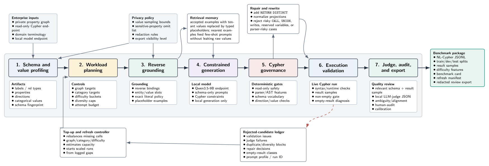

# PIPE-Cypher

PIPE-Cypher is a synthetic data pipeline that creates balanced, executable, privacy-aware NL-to-Cypher benchmarks for enterprise knowledge graphs. The value here is that enterprise graphs are highly differentiated: their schemas, terminology, query patterns, and even the questions users ask are unique to each deployment. A strong coding agent today can probably generate data by inspecting a schema, but PIPE-Cypher makes this scalable, cost-effective, and repeatable when the schema inevitably changes. By constraining this as a pipeline, even small local models can efficiently create large amounts of synthetic benchmark data, with deterministic graph checks for balance, diversity, auditability, and execution validity. That makes it useful for keeping private Text2Cypher benchmarks grounded in how a graph is actually used as it evolves.



## What PIPE-Cypher Does

- Profiles property-graph schemas, relationship directions, properties, and
  bounded categorical values.
- Grounds candidate questions with read-only reverse Cypher queries so examples
  are answerable before natural-language realization.
- Generates NL--Cypher pairs with local OpenAI-compatible model endpoints such
  as vLLM.
- Applies deterministic Cypher governance: read-only safety, schema validity,
  relationship direction checks, exact literal handling, categorical-value
  constraints, execution validation, and conservative rewrites.
- Reviews executable candidates with a local LLM judge and records a full
  accepted/rejected ledger for audit.
- Exports benchmark JSONL splits, benchmark cards, diversity diagnostics,
  redacted review artifacts, and downstream evaluation utilities.

## Quick Start

```bash
python -m pip install -e ".[dev]"
pytest
```

Run an offline smoke generation pass without a graph server or model endpoint:

```bash
python scripts/run_pipeline.py \
  --config configs/local_smoke.yaml \
  --offline-smoke \
  --run-name offline_smoke

python scripts/summarize_run.py artifacts/runs/<run_id>/records.jsonl
```

Inspect a live graph schema:

```bash
python scripts/inspect_schema.py \
  --config configs/enterprise_template.yaml \
  --output configs/schema_enterprise_private.json
```

Run a small enterprise dry run after configuring read-only graph credentials and
a local model endpoint:

```bash
python scripts/run_pipeline.py \
  --config configs/enterprise_template.yaml \
  --run-name enterprise_dry_run
```

## Enterprise Onboarding

Start with [`configs/enterprise_template.yaml`](configs/enterprise_template.yaml)
and the deployment guide in
[`docs/enterprise_onboarding.md`](docs/enterprise_onboarding.md). A typical
deployment flow is:

1. Create read-only graph credentials.
2. Configure schema introspection, value-sampling bounds, and sensitive-property
   omit lists.
3. Serve a local generation/judge model through vLLM or another
   OpenAI-compatible internal endpoint.
4. Run a small dry pass and inspect rejected candidates.
5. Scale generation by category and difficulty targets.
6. Export internal raw benchmarks and redacted review copies.
7. Calibrate the judge with a post-hoc human audit sample.
8. Refresh the benchmark when the graph, values, or user workloads change.

You can also try PIPE-Cypher with an AI coding agent: point the agent at this
repository and your hosted read-only knowledge graph, then ask it to use
`AGENTS.md` and the `.agents/skills/pipecypher-enterprise-benchmark` skill to
configure onboarding, run a dry pass, and export an agent-ready benchmark.

## Benchmark Data Format

Accepted examples are exported as JSONL files with train/dev/test splits. Each
row contains the NL question, Cypher query, graph/category/difficulty metadata,
structural features, validation gates, result samples, and provenance fields.
See [`docs/benchmark_format.md`](docs/benchmark_format.md) for the schema and
recommended evaluation protocol.

## Reproducing the Paper Experiments

The public branch includes a separate reproducibility guide for the experiments
reported in the PIPE-Cypher paper: graph loading, model endpoints, full
generation configs, ablations, diversity selection, judge calibration,
downstream evaluation, and paper-scale result targets. See
[`docs/reproducing_paper_experiments.md`](docs/reproducing_paper_experiments.md).

## Library Surfaces

PIPE-Cypher is organized around reusable library components rather than a
single fixed dataset. The public branch contains:

- schema introspection and schema-card generation for property graphs;
- reverse-grounded candidate generation and slot binding;
- deterministic Cypher validators for read-only safety, labels,
  relationship types, properties, directions, literals, execution, and result
  shape;
- conservative query normalization and rewrite auditing;
- local LLM generation and judging through OpenAI-compatible endpoints;
- privacy redaction, value-sampling policies, and benchmark-card exports;
- diversity selection and diagnostics;
- downstream Text2Cypher evaluation utilities.

Paper source, experiment snapshots, and submission packages are intentionally
kept on the research branch rather than on `main`.

## Repository Layout

- [`pipecypher/`](pipecypher/): pipeline, validators, grounding, diversity,
  judge, export, and reporting modules.
- [`scripts/`](scripts/): command-line entry points for running, exporting,
  auditing, redacting, and evaluating benchmarks.
- [`configs/`](configs/): local smoke, public graph, and enterprise template
  configs.
- [`tests/`](tests/): deterministic tests for pipeline and library behavior.
- [`docs/`](docs/): public deployment, onboarding, and benchmark-format
  documentation.

## License

MIT.
