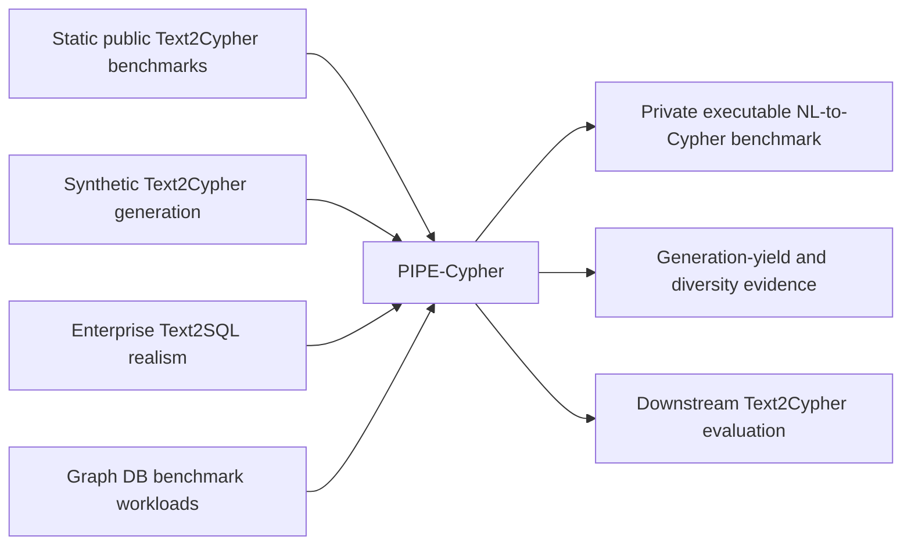

# Literature Review Notes

Date searched: June 1, 2026

Primary search sources used in this pass: ACL Anthology, arXiv, LDBC/GDC pages, and ACM/author-hosted paper pages. The paper should prefer refereed ACL/ACM entries over arXiv entries when both exist.

## Direct Text2Cypher And Graph Query Work

- **Mind the Query** (Chauhan et al., EMNLP Industry 2025) introduces a 27,529-example, 11-graph Text2Cypher benchmark with schema/runtime/value checks and manual review. PIPE-Cypher should position it as the strongest static benchmark/data-synthesis reference, then emphasize that our artifact is a private benchmark-generation pipeline with local models and no human review gate.
- **SyntheT2C** (Zhong et al., COLING 2025) proposes synthetic Text2Cypher data construction with LLM prompting and template filling, applied to medical KGs. PIPE-Cypher should cite it as closest synthetic Text2Cypher generation work, then separate itself through enterprise graph introspection, reverse Cypher binding over real graph values, deterministic safety/schema/direction validation, execution, diversity caps, and LLM judge metadata.
- **Auto-Cypher** (Tiwari et al., NAACL 2025) presents an LLM-supervised generation-verification framework and SynthCypher. This is important because it shares the generation-verification framing; our distinction is that verification is a deployed benchmark factory over the enterprise's own property graph, with read-only Cypher constraints, local-model operation, and explicit automated-vs-human evaluation calibration.
- **Text2Cypher: Bridging Natural Language and Graph Databases** (Ozsoy et al., GenAIK 2025) combines public datasets into 44,387 instances and shows fine-tuning gains. PIPE-Cypher should use it to motivate data scarcity and the need for higher-quality, schema-relevant training/evaluation data.

## Positioning Matrix

| Work | Main artifact | Graph/query focus | Quality control | PIPE-Cypher distinction |
| --- | --- | --- | --- | --- |
| Mind the Query | Public multi-domain benchmark | Text2Cypher over 11 graph datasets | Automated checks plus manual logical review | Private enterprise benchmark generation; LLM judge replaces human gate, with audit calibration |
| SyntheT2C | Synthetic training set and method | Medical Text2Cypher | Prompting and template filling | Reverse-query grounding, execution validation, diversity caps, industry graph workloads |
| Auto-Cypher | Synthetic data generation-verification | Text2Cypher and graph-adapted Spider | LLM-supervised verification | Cypher-first deterministic validator, property-graph schema introspection, local deployment constraints |
| Text2Cypher | Aggregated public dataset | Public Text2Cypher fine-tuning | Dataset cleaning/evaluation | Organization-specific data creation for private schemas and evolving workloads |
| Spider 2.0 | Enterprise Text2SQL benchmark | SQL workflows across cloud/local systems | Execution/workflow evaluation | Transfers enterprise-realism argument to property graphs and Cypher |
| BIRD | Large database-grounded Text2SQL benchmark | SQL over realistic databases | Execution accuracy and value grounding | Motivates non-empty execution, value grounding, and answer-level evaluation |
| AutoQuery | Generated cross-model query workloads | Relational/graph analytics | Rule-based post-processing and error analysis | Motivates strategy-level yield/diversity reporting for generated benchmark workloads |

## Text-to-SQL And Enterprise Benchmarking

- **Spider 2.0** motivates real-world, workflow-style database tasks and emphasizes that legacy text-to-SQL benchmarks understate deployment complexity. Its strongest message for our introduction is that enterprise data interfaces require metadata search, dialect awareness, and complex workflow evaluation rather than toy schemas.
- **BIRD** motivates execution accuracy, realistic database content, value grounding, and efficiency. PIPE-Cypher should borrow the argument that database values matter, then map it to graph literals, categorical properties, and entity-binding queries.
- **CIKM AutoQuery** motivates separating workload generation quality from model quality, reporting execution accuracy, and analyzing strategy-level coverage rather than only category counts.

## Diversity And Benchmark Quality Metrics

- **Distinct-n** from Li et al. (NAACL 2016) is useful for detecting lexical collapse in generated questions. PIPE-Cypher reports Distinct-1/2/3 over benchmark questions, but does not treat lexical diversity alone as sufficient because Text2Cypher benchmarks can be lexically diverse while still reusing the same query template.
- **Self-BLEU** as used in Texygen (SIGIR 2018) is useful as a complementary redundancy diagnostic: lower self-BLEU means generated questions are less mutually similar. PIPE-Cypher reports sampled self-BLEU-2 so the metric is reproducible without expensive all-pairs BLEU over large private exports.
- **MMR-style anti-redundancy** from Carbonell and Goldstein (SIGIR 1998) is the right selection primitive because it optimizes novelty subject to relevance/quality. PIPE-Cypher adapts this idea after quality gates pass: candidate quality is already fixed by deterministic validation and the judge, so the selector can spend its objective on Cypher query signatures, template families, structural substructures, schema atoms, values, and question-token novelty.
- **Schema and structure coverage** are more important for text-to-query than open-ended text generation diversity alone. PIPE-Cypher therefore combines Distinct-n and self-BLEU with normalized Shannon entropy over category, graph-category, difficulty, primary strategy, labels, and relationship types; schema label/relationship/property coverage; query-signature uniqueness after literal/variable normalization; and structural rates for aggregation, ordering, negation, paths, optional matches, and return arity.
- **Adjusted Distinct-n** should be reported next to raw Distinct-n because selected subsets have different sizes. The current implementation reports the ratio between observed unique n-grams and the expected unique n-grams under a fixed reference-size approximation. This is a pragmatic finite-sample correction, not a standard named benchmark score.
- **Current implementation status**: `scripts/select_diverse_benchmark_subset.py` selects a target-balanced subset with MMR-style novelty, writes a diversity report, compares against a hash-balanced random baseline, and exports signature-disjoint train/dev/test splits. On the target-50-per-graph/category subset from the 3,000 accepted examples, the selector improves PIPE-Diversity index (0.520 to 0.524), unique query-signature ratio (0.031 to 0.037), structural substructures (58 to 60), adjusted Distinct-2 (0.252 to 0.265), and property coverage (0.370 to 0.407).
- **Main paper framing**: use diversity metrics to show that the benchmark is balanced by design and to expose remaining concentration. In the current full export, category and difficulty balance are strong, while query-signature diversity is intentionally lower because the accepted local-model run relies heavily on schema-grounded templates. The new post-hoc selector improves coverage, but template-family entropy and self-BLEU still reveal source-pool scarcity. The next research-quality diversity run should overgenerate candidates per graph/category, explicitly reward low-frequency operator/substructure cells during generation, induce or paraphrase additional schema-grounded templates, and then apply the selector before export.

## LDBC Benchmarks

- **LDBC FinBench** is the primary graph target because it represents financial transactions, accounts, loans, and fraud/risk-control workloads. The public LDBC site describes FinBench as targeting anti-fraud and risk-control scenarios, with a transaction workload over complex neighborhood reads and writes.
- **LDBC SNB** is the secondary graph target because it is mature, scalable, and supports social-network graph traversals that stress joins, paths, and ranking. SNB Interactive includes natural-language workload definitions with Cypher reference implementations and is appropriate as a generality check outside finance.

## Conceptual Framing

## LLM-As-Judge

The paper should treat LLM judge review as an automation gate, not as ungrounded truth. The defensible framing is:

- deterministic validation handles safety and schema correctness;
- execution validates query feasibility;
- LLM judge evaluates semantic alignment and ambiguity;
- a small human audit estimates whether judge decisions are credible.

## Research Gap

Existing work provides public Text2Cypher datasets, synthetic Text2Cypher examples, or general text-to-query benchmarks. The missing industry capability is a repeatable way to create private, balanced, executable, Cypher-specific benchmarks from an enterprise graph while preserving governance and avoiding paid API dependence.

## Verified Reference Checklist

- Mind the Query: ACL Anthology entry verified; cite as EMNLP Industry 2025.
- SyntheT2C: ACL Anthology entry verified; cite as COLING 2025.
- Auto-Cypher: ACL Anthology entry verified; cite as NAACL short 2025.
- Text2Cypher: ACL Anthology entry verified; cite as GenAIK 2025.
- Spider 2.0: arXiv entry verified; cite as ICLR 2025 oral if final venue metadata is needed after template cleanup.
- BIRD: arXiv/NeurIPS metadata verified; cite NeurIPS 2023.
- AutoQuery: author-hosted CIKM paper and DOI verified.
- Li et al. diversity objective: ACL Anthology metadata and DOI verified.
- Texygen: IR Anthology/DBLP metadata and DOI verified.
- Carbonell and Goldstein MMR: author-hosted SIGIR 1998 PDF and DOI verified.
- LDBC FinBench: arXiv spec and GDC benchmark page verified.
- LDBC SNB: arXiv Interactive v2 and GDC/SNB page verified.
